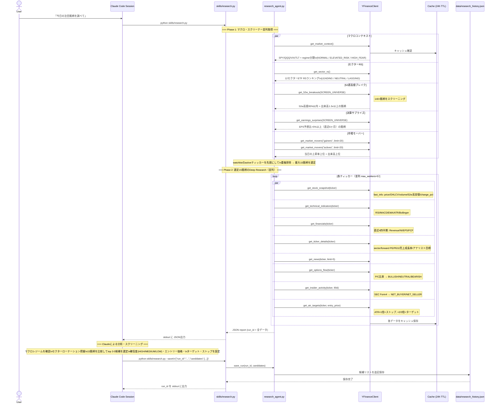
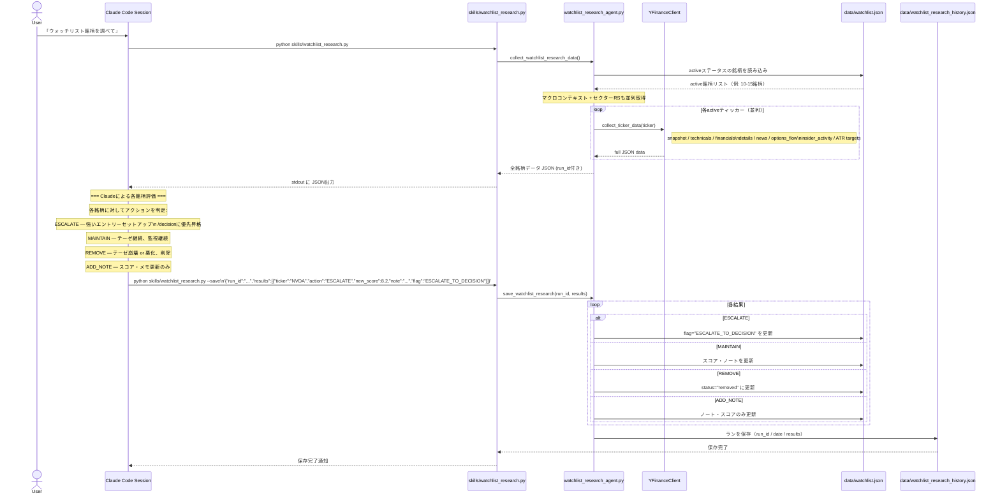
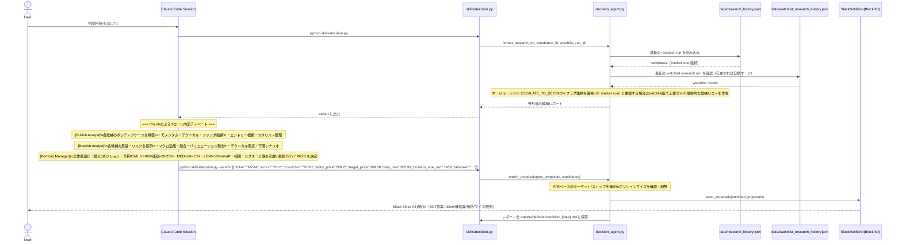
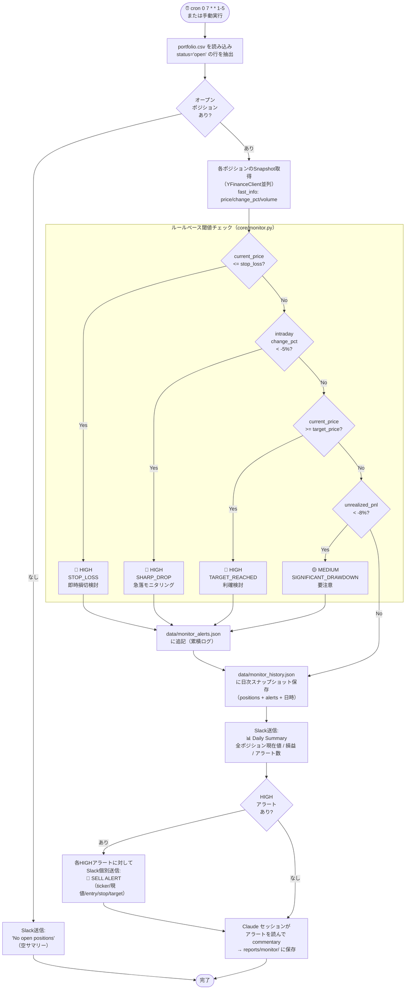
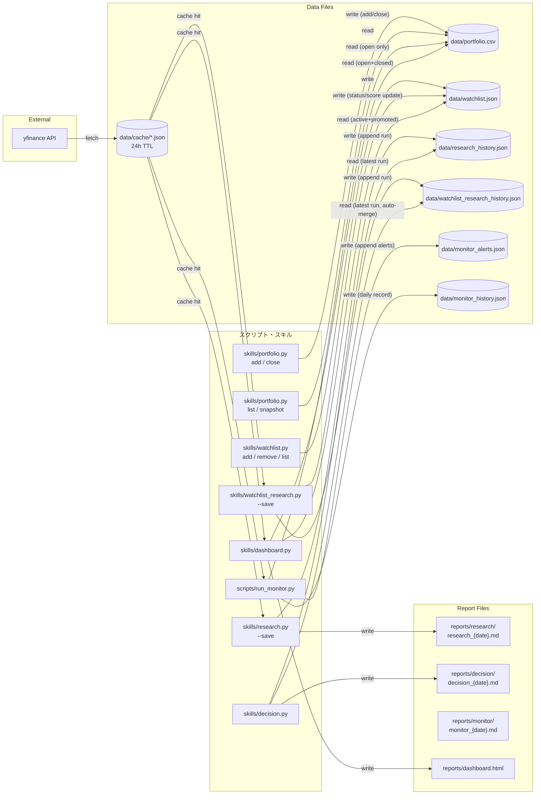
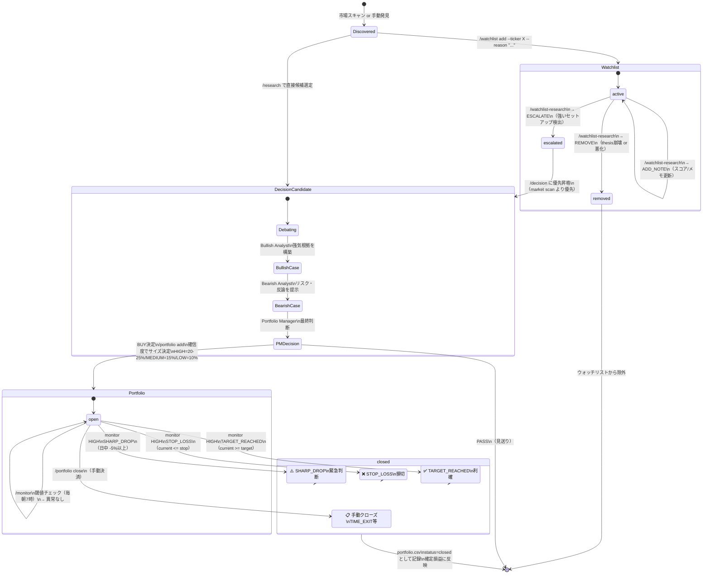

# Investor System Architecture

## 図①: システム全体アーキテクチャ

```mermaid
graph TD
    User(["👤 User / Claude Code Session"])

    subgraph Skills["Skills Layer（エントリポイント）"]
        S1["skills/research.py\n/research"]
        S2["skills/watchlist_research.py\n/watchlist-research"]
        S3["skills/decision.py\n/decision"]
        S4["skills/portfolio.py\n/portfolio"]
        S5["scripts/run_monitor.py\n/monitor (cron 7am)"]
        S6["skills/dashboard.py\n/dashboard"]
        S7["skills/watchlist.py\n/watchlist"]
    end

    subgraph Agents["Agents Layer（データ収集・永続化）"]
        A1["research_agent.py\ncollect_market_data()\ncollect_screen_data()"]
        A2["watchlist_research_agent.py\ncollect_watchlist_research_data()"]
        A3["decision_agent.py\nformat_research_for_claude()\nenrich_proposals()"]
        A4["monitor_agent.py\nMonitorAgent.run()"]
    end

    subgraph DataClients["Data Clients"]
        YF["YFinanceClient\nyfinance_client.py\n─────────────\nget_stock_snapshot()\nget_ohlcv_bars()\nget_financials()\nget_ticker_details()\nget_relative_strength()\nget_market_context()\nget_sector_rs()\nget_52w_breakouts()\nget_earnings_surprises()\nget_options_flow()\nget_insider_activity()\nget_news()"]
        Cache["Cache\nutils/cache.py\n24h TTL\ndata/cache/"]
    end

    subgraph Core["Core Logic"]
        MON["core/monitor.py\ncheck_all_positions()\n─────────────\nSTOP_LOSS\nSHARP_DROP (-5%)\nTARGET_REACHED\nSIGNIFICANT_DRAWDOWN (-8%)"]
    end

    subgraph Ext["External Services"]
        EXT_YF["yfinance\n（無料・APIキー不要）"]
        EXT_SL["Slack Webhook\nBlock Kit通知"]
        EXT_PX["Perplexity API\nWeb検索（任意）"]
        EXT_XA["xAI/Grok API\nX/Twitterセンチメント（任意）"]
    end

    subgraph DataFiles["Data Files（永続化）"]
        DF1["data/portfolio.csv\nopenポジション\nclosedポジション"]
        DF2["data/watchlist.json\nactive / promoted / removed"]
        DF3["data/research_history.json\nリサーチ実行履歴"]
        DF4["data/watchlist_research_history.json\nWLリサーチ履歴"]
        DF5["data/monitor_alerts.json\nアラート累積ログ"]
        DF6["data/monitor_history.json\n日次モニタースナップショット"]
    end

    subgraph Reports["Reports（出力）"]
        R1["reports/research/*.md"]
        R2["reports/decision/*.md"]
        R3["reports/monitor/*.md"]
        R4["reports/dashboard.html"]
    end

    subgraph Notifications["Slack Notifications"]
        N1["投資提案\n(BUY proposals)"]
        N2["日次ポートフォリオ\nサマリー"]
        N3["HIGH アラート\n(個別SELL通知)"]
    end

    User -->|"トリガー"| Skills

    S1 --> A1
    S2 --> A2
    S3 --> A3
    S4 --> DF1
    S5 --> A4
    S6 --> YF
    S7 --> DF2

    A1 -->|"stdout JSON"| User
    A2 -->|"stdout JSON"| User
    A3 -->|"stdout 整形済みレポート"| User

    User -->|"--save 分析結果"| A1
    User -->|"--save アクション判定"| A2
    User -->|"--send BUY提案"| A3

    A1 --> YF
    A2 --> YF
    A4 --> YF

    YF <-->|"読み書き（24h TTL）"| Cache
    YF --> EXT_YF

    A4 --> MON

    A1 --> DF3
    A2 --> DF2
    A2 --> DF4
    A3 --> DF3
    A3 --> DF4
    A4 --> DF5
    A4 --> DF6
    A4 --> MON

    A3 -->|"Block Kit"| EXT_SL
    A4 -->|"Block Kit"| EXT_SL

    EXT_SL --> N1
    EXT_SL --> N2
    EXT_SL --> N3

    A1 --> R1
    A3 --> R2
    S6 --> R4

    S6 --> DF1
    S6 --> DF2
```

---

## 図②: /research フロー

---

## 図③: /watchlist-research フロー

---

## 図④: /decision フロー

---

## 図⑤: /monitor フロー

---

## 図⑥: データファイル 読み書き関係図

---

## 図⑦: ポジション管理ライフサイクル

---

## システム設計原則メモ

| 原則 | 詳細 |
|---|---|
| **Claude Code IS the Agent** | Pythonスクリプトは `anthropic` ライブラリを一切使用しない。Claude Codeセッション自体がエージェント |
| **データフロー** | Python → stdout JSON出力 → Claude読み取り・判断 → Python --save/--send で永続化/通知 |
| **キャッシュ** | yfinanceの全呼び出しは `data/cache/` に24h TTLでキャッシュ。同一銘柄の重複取得を防止 |
| **スキルの役割分担** | Pythonは「データ収集・保存・通知」のみ。「スクリーニング・分析・判断」はすべてClaudeが担当 |
| **ポジションサイジング** | HIGH確信=20-25%、MEDIUM=15%、LOW=10%。1銘柄50%以上禁止、最大5ポジション同時保有 |
| **モニタリング** | ルールベース閾値チェック（Python）+ Claudeコメンタリー（Claude Code）の2層構造 |
